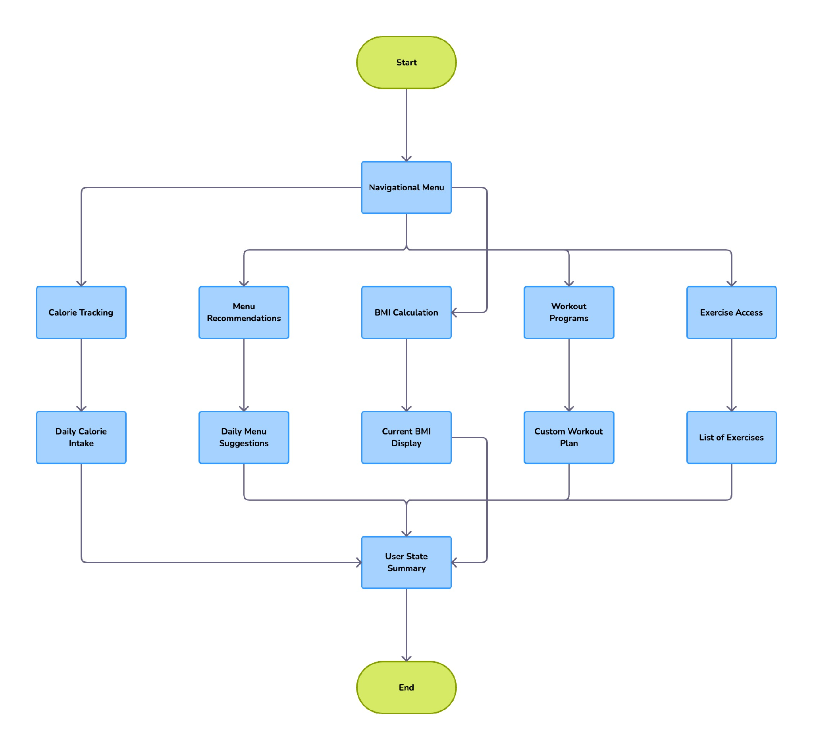

# Fitness Helper

## Описание

Fitness Helper — это мобильное приложение на Kotlin для учета питания и тренировок, находящееся в стадии разработки. 
Оно позволяет пользователям подсчитывать калории, белки, жиры и углеводы (КБЖУ), получать ежедневные рекомендации по меню, рассчитывать индекс массы тела (ИМТ), составлять персонализированные программы тренировок и просматривать демонстрационные видео упражнений.

## MVP и модели приложения

На данном этапе разработки основной фокус сделан на создании backend-части приложения, которая будет обрабатывать основные функции:

- **Модель питания (Nutrition):** Описывает продукты, блюда и их пищевую ценность, позволяет рассчитывать суточное потребление КБЖУ.
- **Модель меню (Menu):** Содержит рекомендуемые меню на основе целей пользователя, учитывает индивидуальные предпочтения и ограничения.
- **Модель ИМТ (BMI):** Рассчитывает индекс массы тела пользователя на основе его роста и веса, предоставляет рекомендации по коррекции веса.
- **Модель тренировок (Workout):** Включает в себя информацию о различных типах тренировок, планах и упражнениях, адаптированных под уровень физической подготовки пользователя.

Каждая из этих моделей взаимодействует друг с другом, чтобы предоставить пользователю персонализированный опыт использования приложения. Разработка API позволит приложению обрабатывать запросы и отдавать данные в удобном для пользователя виде.

## Функционал

1. **Подсчет КБЖУ:** Получайте информацию о калорийности и содержании БЖУ в ваших блюдах.
2. **Рекомендации по меню:** Ежедневные меню, адаптированные под ваши цели и предпочтения.
3. **Расчет ИМТ:** Узнайте свой индекс массы тела и получите рекомендации по его оптимизации.
4. **Программы тренировок:** Индивидуальные тренировочные программы с описанием упражнений.
5. **Отслеживание прогресса:** Ведите учет изменений в вашем весе и объемах.

## Взаимодействие с пользователем

Бот использует интуитивно понятные кнопки для быстрого ответа и встроенные клавиатуры для навигации, делая использование максимально простым и эффективным.

## Стадии перехода в TelegramBot

